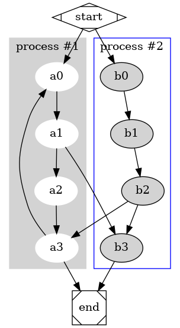
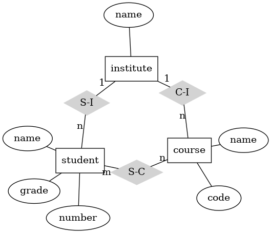

########
Examples
########

Examples are inspired by https://graphviz.org/gallery/.

.. contents::

Clusters
========
https://graphviz.org/Gallery/directed/cluster.html

.. literalinclude:: ../../examples/cluster.json
    :caption: cluster.json

::

    $ cat examples/cluster.json | graphviz-overlay digraph > cluster.dot

.. literalinclude:: cluster.dot
    :caption: cluster.dot

Entity-Relation Data Model
==========================
https://graphviz.org/Gallery/undirected/ER.html

.. literalinclude:: ../../examples/er.json
    :caption: er.json

::

    $ cat examples/er.json | graphviz-overlay er > er.dot

.. literalinclude:: er.dot
    :caption: er.dot

